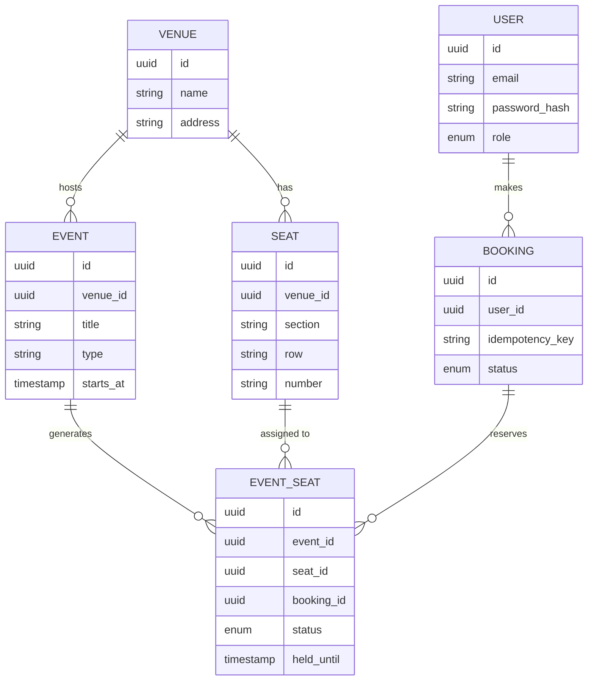
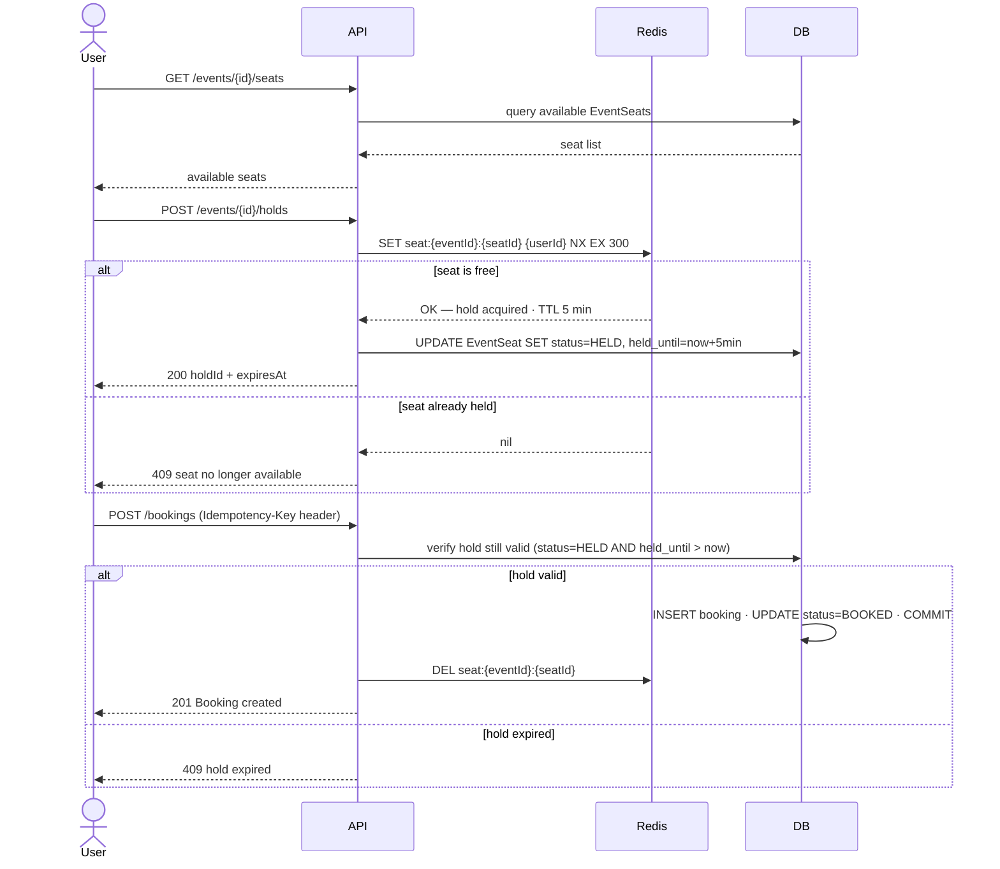

# Seat Booking Service

A backend REST API for booking numbered seats at events — concerts, cinema screenings, flights.
Built to demonstrate production-grade backend thinking: clean domain model, correct concurrency
under contention, versioned migrations, security, tests, and a containerized deliverable.

## Stack

Java 21 · Spring Boot 4 · PostgreSQL · Redis · Flyway · Spring Security (JWT) · Testcontainers · Docker · GitHub Actions

## Domain model

One generalized model covers all three use cases — concert, cinema, flight are just an `Event` type.



`EventSeat.status`: `AVAILABLE → HELD → BOOKED` (and back to `AVAILABLE` on expiry or cancel).

## Booking flow

Hold → Confirm, Ticketmaster-style. Two users racing for the same seat — exactly one wins.



## Running locally

```bash
docker compose up        # starts app + Postgres
```

API docs available at `http://localhost:8080/swagger-ui.html` once the service is up.

## Running tests

```bash
./mvnw verify            # unit + integration tests (Testcontainers spins up Postgres)
```

## Project structure

```
src/main/java/com/troshchii/booking
├── venue       — Venue, seating layout
├── event       — Event, EventSeat, availability
├── booking     — hold/confirm flow, locking
├── user        — User, registration, roles
├── security    — JWT filter, token service
└── common      — global exception handler, config
```

## Design notes

See [`docs/design.md`](docs/design.md) for full rationale behind every decision.
